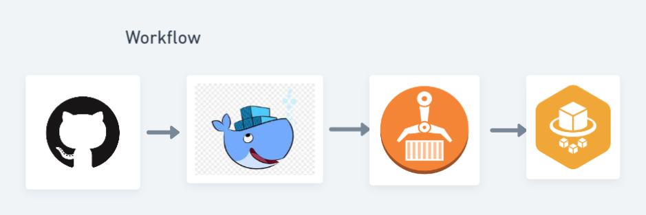
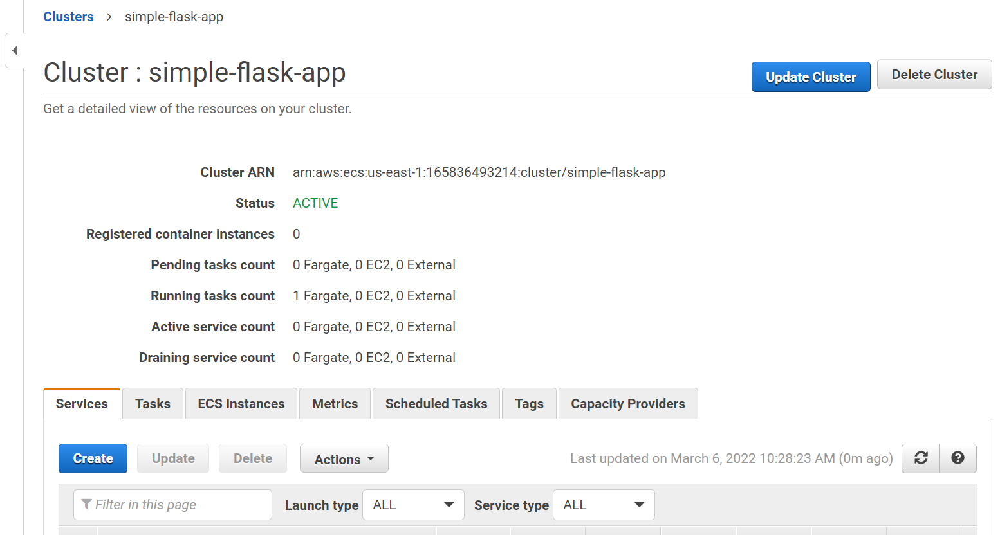

# Hello_world

Develop a simple CI/CD pipeline which builds a docker container and runs it on AWS ECS which is configured for autoscaling and load-balancing.
>Build an Simple Hello world flask app 
>along with Dockerfile and requirements.txt pushed to github 

Dockerize the simple hello world flask application
>Pushed the image to AWS ECR using cli

CI/CD pipeline 
>Developed a CI/CD pipeline using Github Actions to push the updated image to ECR

Deployed the given ECR image to ECS on Fargate Instance

>Thankyou
